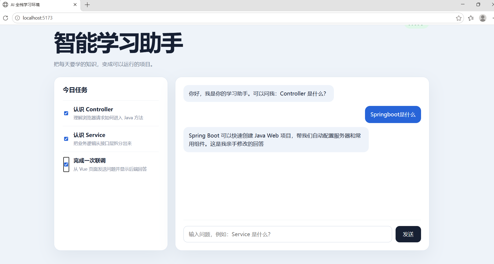
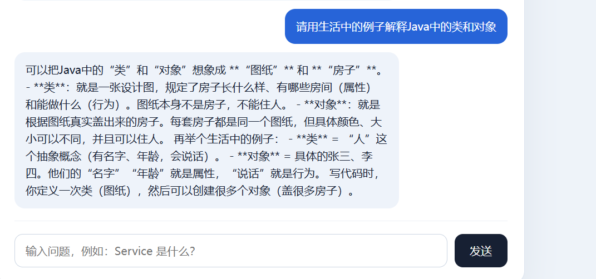
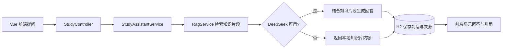

# Java AI 智能学习助手

一个面向 Java 初学者的前后端分离学习项目。系统从本地 Java 知识库检索相关资料，将检索结果作为上下文交给 DeepSeek 生成回答，并把对话和引用来源保存到本地数据库。





## 项目亮点

- **轻量级 RAG**：加载 Markdown 知识库，通过关键词评分检索最相关的两个知识片段。
- **大模型增强回答**：将检索内容与用户问题组合成提示词，通过 Java `HttpClient` 调用 DeepSeek API。
- **无密钥可运行**：未配置 API Key 或模型调用失败时，返回本地知识库中的匹配内容。
- **来源可追溯**：接口返回知识来源，前端可展开查看引用片段。
- **对话持久化**：使用 Spring Data JPA 与 H2 保存问题、回答、来源和创建时间。
- **前后端分离**：Spring Boot 提供 REST API，Vue 页面实现任务清单、问答和历史记录管理。

> 本项目的 RAG 使用关键词匹配，不包含 Embedding 或向量数据库；适合展示检索、上下文增强和降级流程的基础实现。

## 技术栈

| 模块 | 技术 |
| --- | --- |
| 后端 | Java 21、Spring Boot、Spring Data JPA、Bean Validation |
| 数据库 | H2 文件数据库 |
| AI 接入 | DeepSeek API、Java HttpClient |
| 检索 | Markdown 本地知识库、关键词评分 |
| 前端 | Vue 3、Vite、Fetch API |
| 工程化 | Maven、npm、Git |

## 处理流程



## 项目结构

```text
ai-study-assistant/
├─ backend/
│  ├─ src/main/java/com/example/aifullstack/
│  │  ├─ controller/       # HTTP 接口
│  │  ├─ service/          # 问答、检索和模型调用
│  │  ├─ repository/       # 数据库访问
│  │  ├─ entity/           # 对话实体
│  │  └─ dto/              # 请求与响应对象
│  └─ src/main/resources/
│     └─ knowledge-base.md # 本地 Java 知识库
├─ frontend/               # Vue 前端
├─ docs/                   # 项目截图
└─ README.md
```

## 接口说明

| 方法 | 地址 | 作用 |
| --- | --- | --- |
| GET | `/api/study/tasks` | 查询今日学习任务 |
| POST | `/api/study/chat` | 提问并返回回答与知识来源 |
| GET | `/api/study/history` | 查询最多 20 条历史记录 |
| DELETE | `/api/study/history` | 清空聊天记录 |

请求示例：

```json
{
  "question": "Controller 和 Service 有什么区别？"
}
```

## 本地运行

### 环境要求

- JDK 21
- Maven 3.8+
- Node.js 22.12+（或满足 Vite 要求的 20.19+）
- DeepSeek API Key（可选）

### 配置模型密钥

PowerShell 当前窗口临时配置：

```powershell
$env:DEEPSEEK_API_KEY="你的_API_Key"
```

不要把真实密钥写入源码或提交到 GitHub。

### 启动后端

```powershell
cd backend
mvn spring-boot:run
```

后端地址：`http://localhost:18080`

### 启动前端

```powershell
cd frontend
npm install
npm run dev
```

浏览器访问：`http://localhost:5173`

## 数据与隐私

聊天记录默认保存在 `backend/data/`。该目录、真实环境变量、依赖和编译产物均已加入 `.gitignore`，不会上传到 GitHub。

## 后续计划

- 使用 Embedding 与向量数据库升级语义检索；
- 增加知识文档上传与自动切分；
- 增加流式输出和会话分页；
- 增加登录鉴权与自动化接口测试。

## 说明

本项目为个人学习与求职展示项目，重点练习 Java 后端分层、第三方 AI 接口接入、RAG 基本流程和数据持久化。
